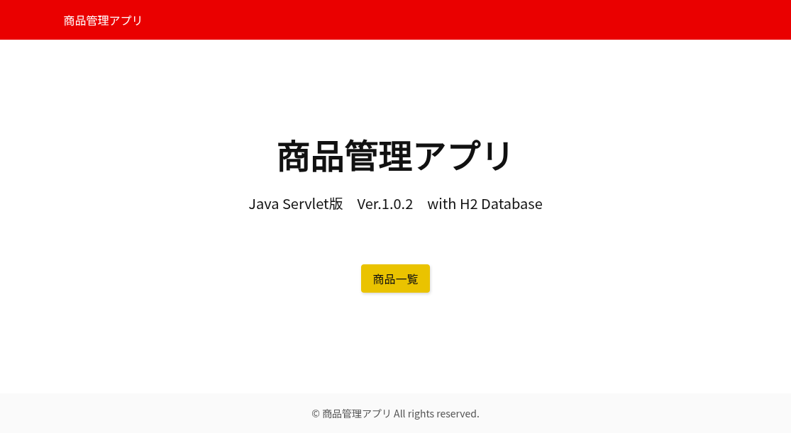

# Inventory Management Servlet

Java Servlet・JSP・JDBCを用いて開発した在庫管理Webアプリケーションです。

**Version:** 1.0.2  
**Status:** Released  
**Database:** H2 Database


## 概要

本アプリは、PHPで開発した在庫管理アプリを、Java Servlet・JSP・JDBCを使って再設計・再実装することを目的として制作した作品です。

教材『スッキリわかるサーブレット＆JSP入門 第5版』を参考に学習を進めながら、画面構成・データベース設計・画面遷移・データの流れを自分で考えて実装しました。

単にPHPのコードをJavaへ書き換えたのではなく、実際にPHP版アプリを動かし、その動きをもとにJavaらしい構成を考えながら設計・実装しています。そのため、処理やクラス構成はPHP版とは異なる部分が多くあります。

本作品を通して、Java Webアプリケーション開発の基礎技術と、既存アプリケーションを別言語で再設計・再実装する力の習得を目指しました。

---

## 使用技術

- Java 17
- Servlet
- JSP
- JSTL
- JDBC
- Maven
- H2 Database 2.4.240
- HTML
- CSS
- Apache Tomcat 10
- IntelliJ IDEA
- Git
- GitHub

---

## 主な機能

- 商品一覧表示
- 商品登録
- 商品編集
- 商品削除
- 商品名検索
- 商品名昇順・降順ソート
- メッセージ表示
- 検索状態を保持した登録・編集・削除

---

## 工夫した点

PHP版の在庫管理アプリと同じ操作性を目標にJavaで再実装しました。

- PHP版と同じ操作性になるよう画面遷移を設計しました。
- 検索条件や並び順をセッションで保持し、登録・編集・削除後も元の一覧へ戻れるようにしました。
- 上記の点は、PHP版には存在しない機能で実質アップグレードしています。
- DAOパターンを採用し、データアクセスとビジネスロジックを分離しました。
- 実際に操作しながら不具合を発見し、検索結果が失われないようロジックを改善しました。
- PHP版の仕様を参考にしつつ、Javaらしいクラス構成や処理の流れを意識して設計しました。

---

## ディレクトリ構成

```text
src/main/java
└── me.nomurahiroshi.inventorymanagementservlet
    ├── servlet
    ├── bo
    ├── dao
    └── model

src/main/webapp
├── css
├── images
└── WEB-INF/jsp
```

---

## 画面

主な画面は以下のとおりです。

### トップ画面



### 商品一覧画面


### 商品登録画面


### 商品編集画面


## データベース

Ver.1.xではH2 Databaseを使用しています。

---

## 今後の開発予定

### Ver.2.0

- PostgreSQL対応
- バッチ処理

### Ver.3.0

- Spring Boot対応

---

## Version History

### v1.0.2（2026-08-06）

#### Added

- 商品削除前の確認画面を追加

#### Improved

- 削除処理をPOSTで実行するよう改善
- セッション取得処理を見直し、不要なセッションが作成されないよう改善

#### Changed

- アプリケーションのバージョン表記をVer.1.0.2へ更新
- 

### v1.0.1（2026-08-05）

#### Fixed

- トップページへ戻る際に、検索条件を保持するセッション属性を削除するよう修正
- 検索後に商品を登録・編集した場合でも、検索キーワードを検索窓へ再表示するよう修正
- 検索後の並べ替えで、意図せず全件表示へ戻る問題を修正

#### Changed

- トップページの表記を「Servlet & JSP版」から「Java Servlet版」へ変更
- アプリケーションのバージョン表記をVer.1.0.1へ更新

### v1.0.0（2026-08-03）

- 初回リリース
- 商品の一覧表示・登録・編集・削除
- 商品名検索
- 商品名の昇順・降順ソート
- 検索条件のセッション保持
- H2 Database対応
- Herokuへのデプロイ

## 作者

野村　広

## 公開について

本プロジェクトは、ポートフォリオ・学習目的で公開しています。
